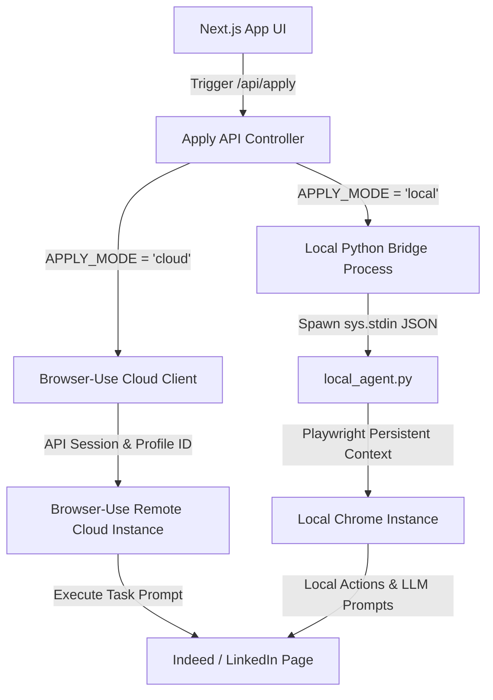
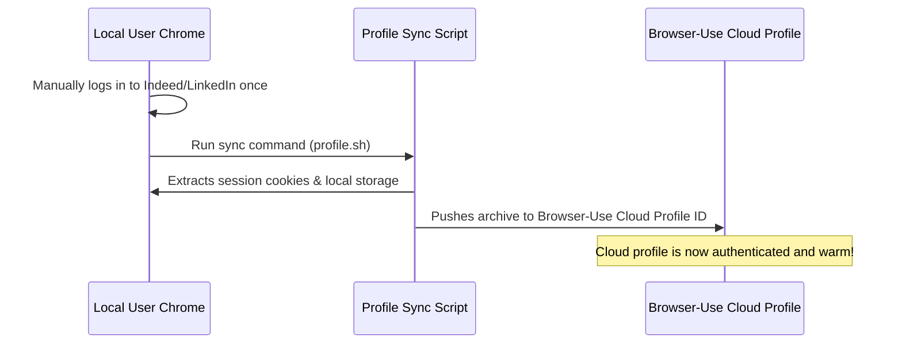
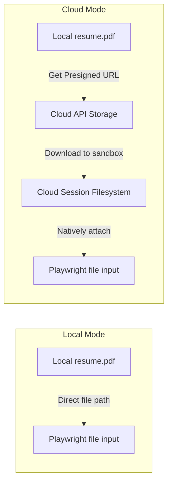
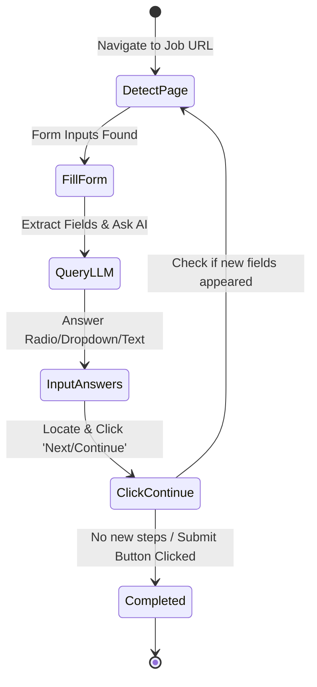
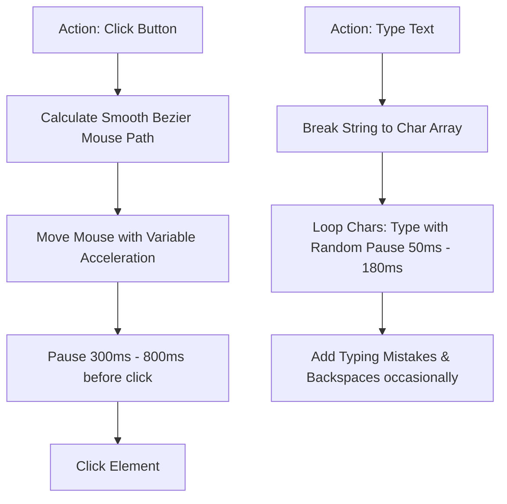

# 🎯 JobPilot AI: Comprehensive Auto-Apply & Job Automation Plan (Browser-Use SDK)

This plan outlines the architecture, strategies, and implementation details required to transform JobPilot's Auto-Apply feature into a bulletproof, human-like automation system. It is designed to navigate the strict security protocols (Cloudflare, Arkose Labs, Datadome) of platforms like **Indeed** and **LinkedIn**, solve multi-step forms, upload resumes natively, and execute actions with a highly realistic, human footprint.

---

## 📖 Table of Contents
1. [Core Architectural Blueprint](#1-core-architectural-blueprint)
2. [Bypassing Anti-Bot & Stealth Infrastructure](#2-bypassing-anti-bot--stealth-infrastructure)
3. [Warm Session & Persistent Cookie Management](#3-warm-session--persistent-cookie-management)
4. [Universal Resume & Document Upload Mechanism](#4-universal-resume--document-upload-mechanism)
5. [Intelligent Form Questionnaire & AI Screening Engine](#5-intelligent-form-questionnaire--in-stride-ai-screening-engine)
6. [Human Emulation Engine (Micro-Interactions)](#6-human-emulation-engine-micro-interactions)
7. [Error Handling, CAPTCHA Recovery & Guardrails](#7-error-handling-captcha-recovery--guardrails)
8. [Concrete Step-by-Step Transition Plan](#8-concrete-step-by-step-transition-plan)

---

## 1. Core Architectural Blueprint

To ensure complete robustness, we utilize a dual-execution bridge model. The system operates in two modes—**Cloud Mode** (utilizing the managed Browser-Use Cloud API) and **Local Mode** (using an open-source local python agent with Playwright). This ensures seamless performance whether running in serverless production (e.g., Vercel) or running on a local desktop machine.

### Dual-Bridge Architecture



### Key Differences & System Setup
*   **Browser-Use Cloud Mode**: Executes the browser container on high-end hosted virtual machines. Extremely reliable for Vercel deployment where local browser execution is restricted by serverless execution limits.
*   **Local Mode**: Spawns a dedicated Python subprocess (`scripts/apply_local.py`) using your **actual local Google Chrome** installation. Inherits all local history, GPU profiles, and active logged-in cookies directly from your machine.

---

## 2. Bypassing Anti-Bot & Stealth Infrastructure

LinkedIn and Indeed use advanced machine learning algorithms (like Cloudflare, Datadome, and Arkose Labs) that screen for automated scripts. Traditional scraping frameworks fail immediately. Here is the blueprint to neutralize these defenses.

### Stealth Playwright Setup (Local Mode)
We configure Playwright to strip away all standard automation signatures:
1.  **WebDriver Removal**: Prevent `navigator.webdriver = true` from being set in the browser's context.
2.  **Fingerprint Spoofing**: Ensure the browser uses the native Google Chrome application rather than default Chromium. This inherits real native font libraries, canvas fingerprints, and GPU drivers.
3.  **Blink Flags**: Launch with parameters to disable internal automation flags.

```python
# Playwright Stealth Configuration
user_data_dir = os.path.expanduser("~/Library/Application Support/Google/Chrome/Default")
browser = await p.chromium.launch_persistent_context(
    user_data_dir=user_data_dir,
    channel="chrome",  # MUST use native Chrome, not Chromium
    headless=False,    # Headless mode is an immediate red flag
    viewport=None,     # Inherit native screen viewport
    args=[
        "--disable-blink-features=AutomationControlled", # Hides Playwright signature
        "--no-sandbox",
        "--disable-infobars",
        "--window-position=0,0",
        "--disable-features=IsolateOrigins,site-per-process"
    ]
)
```

### Proxy Routing Strategy
*   **Residential Proxies**: In both Local and Cloud modes, all requests must be routed through high-quality **residential IP pools** matching the user’s country. Datacenter IPs (AWS, Vercel, DigitalOcean) are permanently flagged.
*   **Consistent Geolocation**: Ensure the proxy location remains consistent. Moving from the user’s home IP to a proxy across the world within 5 minutes triggers security locks. The proxy should mimic the home region.

---

## 3. Warm Session & Persistent Cookie Management

Repeatedly entering credentials, solving 2FA codes, or logging in from strange locations is highly risky. **Session Warming** is the key: we preserve the authenticated state across days.



### Implementation Steps

#### A. Cloud Mode Syncing
We leverage Browser-Use Cloud's profile synchronization. The user logs in manually to Indeed and LinkedIn in their normal browser, then uploads the cookies:
```bash
# Push local authenticated profile to the cloud
curl -fsSL https://browser-use.com/profile.sh | BROWSER_USE_API_KEY=bu_your_key sh
```
This syncs active cookies, session histories, and local data. The API call uses the registered `BROWSER_PROFILE_ID` to launch the cloud browser in this already-warm state.

#### B. Local Mode Direct Profile Mapping
Instead of launching a clean slate, the local agent binds to the user's active Chrome data folder. It inherits active logins instantly, bypassing 2FA requirements.
> ⚠️ **Important Guardrail**: Chrome limits file access to one process at a time. The local script must verify that the user's main Chrome app is completely closed before executing, or launch using a duplicated user-profile directory to prevent profile locking errors.

---

## 4. Universal Resume & Document Upload Mechanism

A major limitation in current auto-apply scripts is skipping jobs that require a resume or cover letter. Since almost 95% of job posts require a resume, solving this is critical.



### A. Local Mode: Absolute Path Binding
When running locally, Playwright can attach files directly from the user's operating system:
```python
# Select the file input element and upload
resume_input = page.locator('input[type="file"][id*="resume"], input[type="file"][name*="resume"]')
if await resume_input.count() > 0:
    absolute_resume_path = os.path.abspath(my_profile['resume_path'])
    await resume_input.set_input_files(absolute_resume_path)
```

### B. Cloud Mode: Presigned Storage Upload Bridge
Since the Browser-Use cloud container cannot access the user's local filesystem, the Next.js API acts as a secure bridge:
1.  **Retrieve File**: The UI uploads the resume file (`.pdf`) and stores it temporarily in memory or cloud storage (e.g. Vercel KV / Blob / S3).
2.  **Request Upload URL**: We request a secure, temporary upload URL from the Browser-Use Session API.
3.  **Push Document**: We stream the PDF from our server to the session's sandbox.
4.  **Reference in Agent Task**: We instruct the agent to use the local file path `/workspace/resume.pdf` during the form filling.

```typescript
// Next.js API Bridge to upload resume to Cloud session
import httpx from "axios";

async function prepareCloudResume(client: any, sessionId: string, fileBuffer: Buffer) {
    // 1. Get the upload URL from Browser-Use Cloud Session
    const uploadUrlResponse = await client.files.getSessionUploadUrl({
        sessionId: sessionId,
        fileName: "resume.pdf",
        contentType: "application/pdf",
        sizeBytes: fileBuffer.length
    });
    
    // 2. HTTP POST the file to the presigned URL
    await httpx.post(uploadUrlResponse.url, fileBuffer, {
        headers: { "Content-Type": "application/pdf" }
    });
    
    console.log("📄 Resume successfully uploaded to remote cloud session!");
}
```

---

## 5. Intelligent Form Questionnaire & In-Stride AI Screening Engine

Many modern job applications feature multi-step questionnaires with arbitrary screening questions. Hard-coded rules cannot handle this. We solve this by using an **LLM In-Stride Reasoning Loop**.



### The LLM Context Strategy
Instead of just sending the HTML structure, the agent is supplied with a comprehensive **Profile JSON** that provides answers to various domains of questions:

```json
{
  "personal_info": {
    "first_name": "Jane",
    "last_name": "Doe",
    "email": "jane.doe@example.com",
    "phone": "+1 555 123 4567",
    "location": "San Francisco, CA"
  },
  "work_authorization": {
    "us_citizen": true,
    "requires_sponsorship": false,
    "authorized_to_work": true
  },
  "professional_experience": {
    "years_of_experience": 5,
    "years_of_react": 4,
    "years_of_typescript": 4,
    "years_of_node": 5,
    "highest_degree": "Bachelor's in Computer Science"
  },
  "compensation": {
    "desired_salary_usd": 120000,
    "currency": "USD"
  }
}
```

### In-Stride Form Processing Logic
The agent evaluates the DOM at every step. It extracts input labels, options (radios, selects), placeholder texts, and feeds them dynamically to the LLM to choose the exact action:
*   **Radio / Checkbox**: Match keywords like "Yes/No" or "Work Authorization" against the profile and check them.
*   **Select / Dropdown**: Find the closest option matching the user’s values (e.g. select "Bachelor's" if the profile lists "Bachelor's in Computer Science").
*   **Text Inputs**: Type descriptive or numeric answers (e.g., "5" for years of experience).

---

## 6. Human Emulation Engine (Micro-Interactions)

Platforms trace interaction physics to flag non-human activity. To ensure complete safety, our automation must execute every action through a realism emulator:

### Human Interactions Emulation Blueprint



### Key Elements of Human Emulation

1.  **Typing Cadence**: Never dump text into forms using direct value setting. Keystrokes must be sent sequentially with small, randomized delays (50ms to 180ms) between characters to simulate real human fingers.
2.  **Dynamic Reading Time**: After navigating to a page, do not act instantly. Wait 2 to 5 seconds to simulate a human scanning the title, layout, and job details.
3.  **Smooth Mouse Tracking**: Calculate curved bezier coordinates when moving the pointer from one element to another, adding small tremors and speed fluctuations.
4.  **Simulated Reading Scrolls**: Scroll down the page in small increments (e.g. 100-300px), pause briefly as if reading, and then continue.

---

## 7. Error Handling, CAPTCHA Recovery & Guardrails

Automation must be resilient to unexpected popups, network drops, and security challenges. We implement a triple-layered security guardrail system:

### A. Automatic Cloudflare Patience Algorithm
When facing a Cloudflare verification page:
*   **Do not press keys rapidly**: This registers as bot panic.
*   **Hold**: Idle the browser for 15-30 seconds. Most advanced residential proxies will trigger automatic validation without any interaction.
*   **Click-and-Hold**: If a "Verify you are human" checkbox is visible, wait exactly 5 seconds, move the cursor to it slowly, click it once, and wait another 20 seconds.

### B. "Human-in-the-Loop" Live Stream Bridge
If the agent encounters a complex CAPTCHA (e.g. Arkose match-the-angle puzzle):
1.  **Pause & Raise Alert**: The agent halts execution, sets status to `AWAITING_HUMAN_SOLVER`.
2.  **Live Interaction**: Since Next.js triggers Browser-Use Cloud which returns a `liveUrl` (e.g. `https://cloud.browser-use.com/thread/...`), the user can open this URL directly from the JobPilot UI and **solve the CAPTCHA manually** inside their screen!
3.  **Resume**: Once solved, the agent resumes execution automatically from where it got stuck.

### C. Resource Safeguards
*   **Auto-Stop Timeout**: To prevent running up massive bills, every session is initialized with a strict **5-minute timeout**. If an application takes longer than 5 minutes due to getting stuck in loops, the session is forcefully terminated and the job is marked as skipped.
*   **Daily Application Limits**: A strict guardrail is placed in `src/api/cron/apply.ts` capping total automated submissions to **15 applications per day** to prevent account flag triggers.

---

## 8. Concrete Step-by-Step Transition Plan

To successfully roll out these robust improvements without breaking the current Next.js code, follow this structured phase system:

### 📅 Phase Checklist

- [ ] **Phase 1: Resume Upload Setup**
  - Implement a secure Next.js API route to save user resumes temporarily.
  - Integrate Browser-Use Cloud’s `getSessionUploadUrl` endpoint to stream PDF files into the active browser session.
  
- [ ] **Phase 2: Local Playwright Stealth Configuration**
  - Update `scripts/apply_local.py` with custom Chrome profile loading.
  - Implement dynamic process checks to verify if the main local Google Chrome is running before launching to avoid folder locking.
  
- [ ] **Phase 3: Form Solver Expansion**
  - Replace the naive form selector mapping in `scripts/apply_local.py` with an interactive multi-step while-loop.
  - Expand the LLM prompt instructions to support checkboxes, dropdown selections, and input-based question types.
  
- [ ] **Phase 4: Session Sync Integration**
  - Save the cookie export script `profile.sh` to `/scripts/profile.sh` for easy user synchronization.
  - Add instructions to the UI settings page to guide users through syncing their authenticated profiles to the cloud.

- [ ] **Phase 5: User Interface Polish**
  - Render the active Browser-Use Cloud live-stream iframe on the `PipelinePage` so users can watch and solve CAPTCHAs in real-time.

---
*Created by Antigravity AI Code Companion, Google DeepMind Team.*
